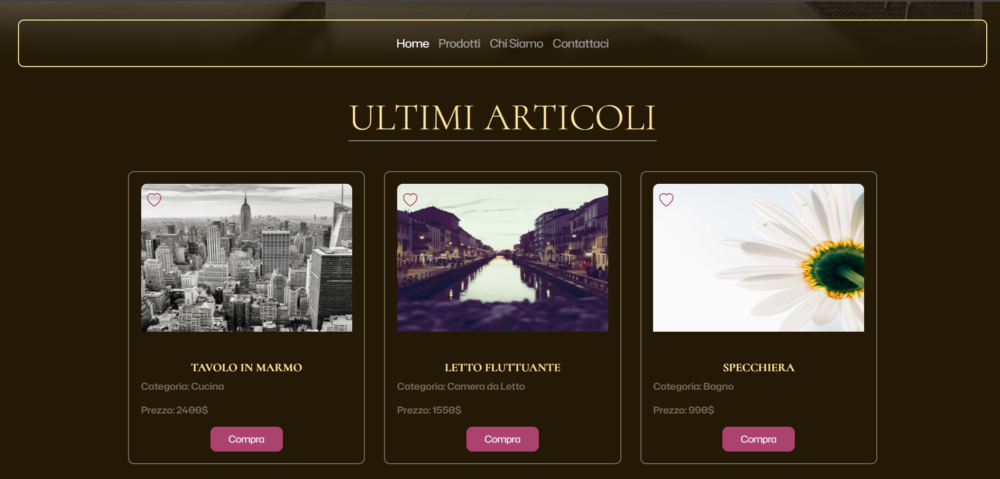
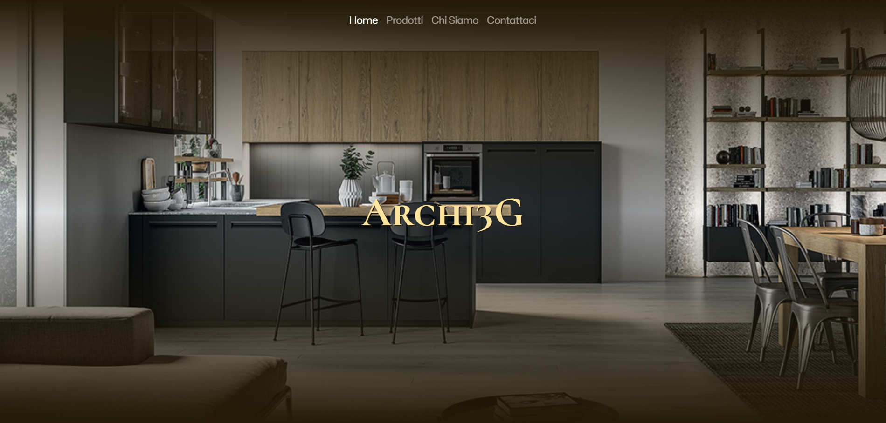
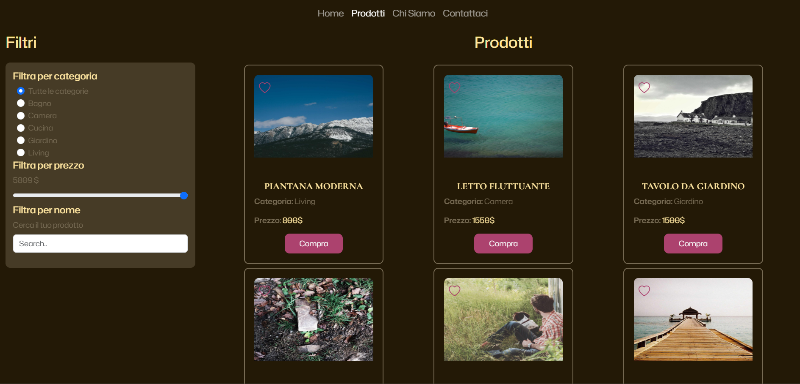

# Archi3G 🛋️

**Archi3G** è un sito vetrina di arredamento luxury, sviluppato con HTML, CSS, JavaScript e Bootstrap. Il progetto è pensato per mostrare prodotti di design in modo elegante e responsive.

## 🌐 Panoramica

Il sito si compone di due pagine principali:

- **Homepage**: 
  - Hero con immagine di apertura
  - Sezione "Ultimi Articoli"
  - Sezione "Categorie"
  - Sezione "Recensioni"
  - Sezione "I miei numeri" con conteggio dinamico (views, recensioni)

- **Pagina Prodotti**:
  - Elenco di prodotti sotto forma di card
  - Sistema di **filtro** per categoria, prezzo e nome

## 🛠️ Tecnologie utilizzate

- HTML5
- CSS3
- JavaScript
- Bootstrap 5

## 🚀 Come eseguire il progetto

1. Clona la repository:
   ```bash
   git clone git@github.com:gio99311/Archi3G.git

## FONT
Cormorant Unicase
Hubot Sans

## PALETTE
primary: #fbf5f3
secondary: #230C06 o #231906
accent: #AA225B

## 📸 Screenshot

### Homepage



### Pagina Prodotti

